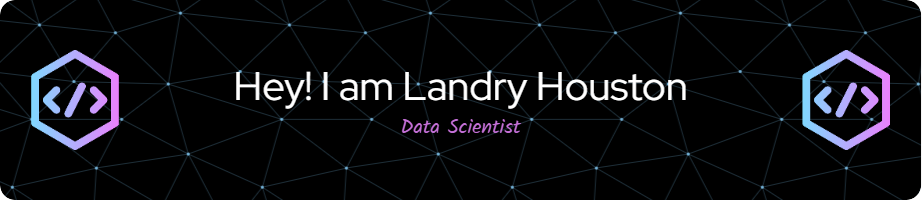

    
    
    

 

 

 

  
   
  

 

    
<strong>Current project:</strong>

    
    
A fun and exciting challenge where I complete a new Python project every day for 100 days!

 

    
    

    
    

    
    

